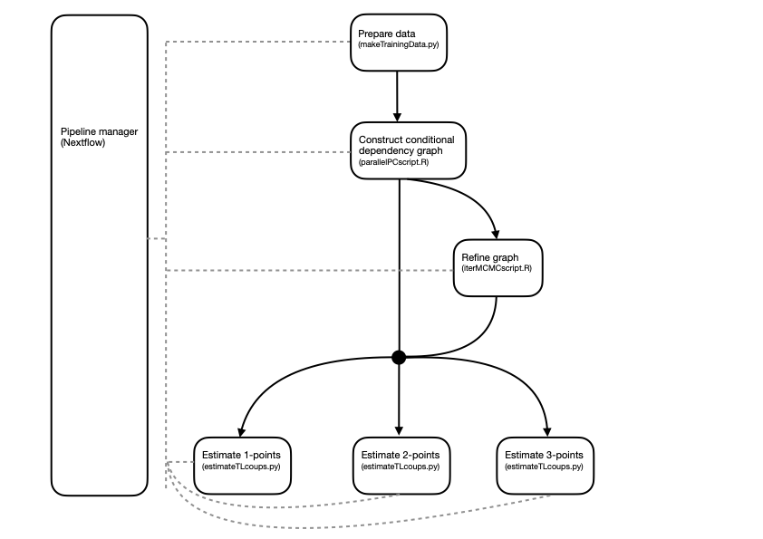

# SCIBERNets

**S**ingle **C**ell **I**nference as **B**oolean **E**xpression **R**egulation **Net**works. 

or maybe:
# CoComix
**Co**nditional **Co**uplings in (transcript-)**omics** data. 

## Introduction
This pipeline takes in single cell RNA-seq count matrices, and estimates gene-interactions at first, second, and third order. 
The pipeline can be run directly from the command line. It pulls all code from Github, and the container from Dockerhub. It can run on your local machine, or on a cluster with the Sun Grid Engine scheduling system (like Eddie). 


## Design/DAG



## Requirements

Nextflow needs to be installed on the machine you want to run the pipeline on, which is as simple as running:

```bash
curl -s https://get.nextflow.io | bash
```

Secondly, you must have access to either Docker or Singularity. Most clusters (like Eddie) use Singularity for security reasons, but both will automatically pull the right container from DockerHub. (Conda environments are supported, but not recommended or guaranteed to work.)

## Input files

* rawDataPath: A count matrix in csv format, where the rows are cells, and the columns genes. The first row should contain the gene names (does not matter in which format). 
* clusterFile (optional): A list of integer cluster annotations per cell in csv format: This should be in the same order as the cells in the count matrix. 
* userGenes (optional): A list of genes that should be included in the final analysis, irrespective of their variability.  
* genesToOne (optional): A list of genes that should be conditioned to a 1 instead of a 0.  
* doubletFile (optional): A list of booleans on whether or not a cell should be included (e.g. on the basis of being a suspected doublet), in the same order as the cells in the count matrix. 


## Output files
* `output/`
    * `trainingData_CL{$cluster}_{$nCells}Cells_{$nGenes}Genes.csv`: The nCells x nGenes count matrices after filtering.
    * `{$graphType}graph_CL{$cluster}_{$nCells}Cells_{$nGenes}Genes.csv` files with the nGenes x nGenes adjacency matrices for the graphs used in the estimation steps.
* `coupling_output/`
    * `interactions_order{$order}[...]_coup.npy` files with the interactions at each order (in `coupling_output/`). 
    * `interactions_order{$order}[...]_CI_U(L)B.npy` files with upper (lower) bound of the 95% confidence interval.
    * `interactions_order{$order}[...]_CI_F.npy` files with fraction of resamples with a different sign than the point estimate (F-value).
    * `interactions_order{$order}[...]_inf(undef).npy` files with fraction of resamples that were infinite (undefined).
    * `interactions_withinMB){$order}pts[...]_inf(undef).npy` files with fraction of resamples that were infinite (undefined).
    * `trainingData_CL{$cluster}_{$nCells}Cells_{$nGenes}Genes_{$embedding}coords.csv`: files with PCA or UMAP embeddings of the cells (in `embeddings/`). 

* `HOIsummaries/`
    * `{$genes}_summary.png`: Figures that summarise the 3-, 4-, and 5-point interactions. 
    * `topDeviatingHOIstates.csv`: A list of the significantly deviating characteristic states. 
    * `distinctDeviatingStates.png`: The characteristic states embedded in PCA coordinates. 
    * `distinctDeviatingStates_dendrogram.png`: The characteristic states embedded in PCA coordinates, in a dendrogram. 
* `plots/`
    * `.png`: figures with basic QC metrics.
* `reports/`
    * some reports from Nextflow on resource usage etc.


## Parameters
The pipeline takes in a number of parameters, which can be set by the user in the params.json file. 

These affect the calculation and the results:
| Parameter | Default | Description | Required? | 
| :----- | :----- | :----- | :-- |
| dataType | ' ' | type of input data: determines preprocessing | Yes |
| rawDataPath | ' ' | absolute path to count matrix .csv | Yes |
| nGenes | ' ' | Number of genes to keep | Yes |
| nCells | ' ' | Number of cells to keep | Yes |
| clusterFile | ' ' | absolute path to cluster annotation .csv | No |
| clusterArray | ' ' | List of which clusters to keep | No |
| doubletFile | ' ' | absolute path to doublet annotation .csv | No |
| userGenes | ' ' | absolute path to list of required genes .csv | No |
| fracMito | 1 | cells with more than `fracMito` mitochondrial reads get dismissed | No |
| fracExpressed | 1 | cells with more fewer than `fracExpressed` of all genes expressed get dismissed | No |
| PCalpha | 0.05 | Significance threshold to use for the PC-algorithm | Yes |
| bsResamps | 1000 | Number of bootstrap resamples to use when calculating confidence intervals on interactions | Yes |
| nRandomHOIs | ' ' | How many random 4-7-point interactions to calculate | Yes |
| minStateDeviation | ' ' | Min. enrichmnent factor for characteristic states | Yes |
| stateDevAlpha | ' ' | Min. enrichmnent significance for characteristic states | Yes |
| dendCutoff | ' ' | Dice distance at which the dendrogram gets cut | Yes |


And these affect the resources accessible to each of the processes, but shouldn't affect the results:
| Parameter | Default | Description | Required? | 
| :----- | :----- | :----- | :-- |
| executor | ' ' | How to execute the pipeline ('sge' for cluster usage) | Yes |
| maxQueueSize | ' ' | How many jobs are allowed to be scheduled at the same time | Only with 'sge' |
| [cores, mem, time]\_makeData | [1, '4G', '1h'] | How many [cores, memory, hours] are available when preparing the data | Only with 'sge' |
| [cores, mem, time]\_PC | [1, '4G', '1h'] | How many [cores, memory, hours] are available to the PC-algorithm | Only with 'sge' |
| [cores, mem, time]\_MCMC | [1, '4G', '1h'] | How many [cores, memory, hours] are available to the MCMC scheme | Only with 'sge' |
| [cores, mem, time]\_1pt | [1, '4G', '1h'] | How many [cores, memory, hours] are available to the 1-point estimation | Only with 'sge' |
| [cores, mem, time]\_2pt | [1, '4G', '1h'] | How many [cores, memory, hours] are available to the 2-point estimation | Only with 'sge' |
| [cores, mem, time]\_3pt | [1, '4G', '1h'] | How many [cores, memory, hours] are available to the 3-point estimation | Only with 'sge' |
| [cores, mem, time]\_HOIs_MB | [1, '4G', '1h'] | How many [cores, memory, hours] are available to the 3-5-point estimations within Markov blankets | Only with 'sge' |
| [cores, mem, time]\_HOIs_6n7 | [1, '4G', '1h'] | How many [cores, memory, hours] are available to the 6- and 7-point estimations | Only with 'sge' |
| [cores, mem, time]\_HOIs_plots | [1, '4G', '1h'] | How many [cores, memory, hours] are available for plotting the HOI summaries and characteristic states | Only with 'sge' |


## Usage

First, you need to pull the latest version of the pipeline from Github. This is done by:


```bash
nextflow pull AJnsm/NF_TL_pipeline -r branch
```
where branch is set to either `main` (most stable) or `develop`. On a cluster, you need to load Singularity. On Eddie this is done with 


```bash
module load singularity
```

 Then, from the directory where you want the output directories to be generated, the pipeline can be run with the command:

```bash
nextflow run AJnsm/NF_TL_pipeline -r main -profile eddie_singularity -params-file params.json
```

Where ```-r main ``` specifies the branch/revision, ```-profile eddie_singularity``` selects the right profile for the Eddie environment, and ```-params-file params.json``` specifies a JSON file with the necessary parameters. An example JSON file is provided in this repository.


**NOTE: On a cluster, you need to make sure you are on a node that allows automated job submission. On Eddie these are known as the wild-west nodes.**

## To do

* make sure running locally is working, has a good profile, and is explained
* show a full run on some example data. 


